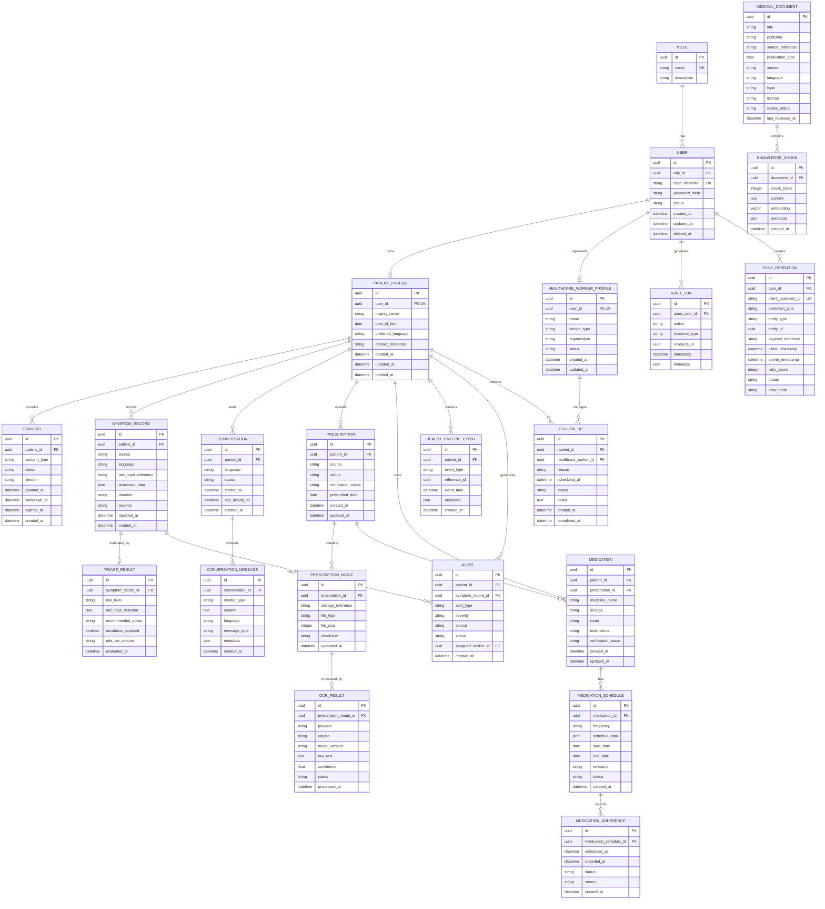

# MedGuide AI — Entity Relationship Diagram (ERD) Specification

**Document:** `docs/database/ERD.md`  
**Version:** 2.0  
**Status:** **Development Baseline — Approved**  
**Primary Identifier Strategy:** UUID  
**Database:** PostgreSQL  
**Vector Extension:** `pgvector`  
**Related Documents:**

* `docs/database/DATABASE_DESIGN.md`
* `docs/architecture/SYSTEM_ARCHITECTURE.md`
* `docs/architecture/TECHNOLOGY_STACK.md`
* `docs/requirements/SRS.md`
* `docs/requirements/USE_CASES.md`
* `docs/requirements/TRACEABILITY_MATRIX.md`
* `docs/requirements/PRE_DEVELOPMENT_DECISIONS.md`

---

# 1. Purpose

This document defines the entity relationships and logical database structure for MedGuide AI.

The ERD supports the complete patient-to-healthcare-worker workflow:

```text
Sign In
   ↓
Consent
   ↓
Patient Profile
   ↓
Preliminary Symptom Checker
   ↓
Deterministic Triage
   ↓
AI / RAG Guidance
   ↓
Prescription OCR
   ↓
Medication Verification
   ↓
Medication Schedule
   ↓
Adherence
   ↓
Health Timeline
   ↓
Healthcare Worker Follow-up
```

The database also supports:

* Multilingual interaction
* AI conversation storage
* RAG knowledge management
* Offline synchronization
* Auditability
* AI provider traceability
* Healthcare-worker access control

---

# 2. Core ERD Principles

The database follows five important separation principles.

```text
┌───────────────────────────────┐
│ 1. PATIENT-REPORTED FACT      │
│ "I have fever for 3 days."    │
└───────────────┬───────────────┘
                ↓
┌───────────────────────────────┐
│ 2. STRUCTURED DATA            │
│ symptom = fever                │
│ duration = 3 days              │
└───────────────┬───────────────┘
                ↓
┌───────────────────────────────┐
│ 3. RETRIEVED KNOWLEDGE        │
│ Approved medical sources       │
└───────────────┬───────────────┘
                ↓
┌───────────────────────────────┐
│ 4. AI-GENERATED OUTPUT        │
│ Explanation / guidance        │
└───────────────┬───────────────┘
                ↓
┌───────────────────────────────┐
│ 5. SYSTEM DECISION             │
│ Deterministic triage          │
└───────────────────────────────┘
```

These layers must remain distinguishable in the application and database.

---

# 3. Identifier Strategy

All major entities use **UUID primary keys**.

### Why UUID?

UUIDs support:

* Distributed application architecture
* Offline record creation
* Client-generated identifiers
* Synchronization
* Idempotency
* Reduced predictability of resource IDs

Example:

```text
patient_id =
550e8400-e29b-41d4-a716-446655440000
```

The database should use a PostgreSQL-compatible UUID type rather than storing UUIDs as arbitrary strings.

---

# 4. High-Level Relationship Tree

```text
ROLE
 │
 └── USER
      │
      ├── PATIENT_PROFILE
      │      │
      │      ├── CONSENT
      │      ├── SYMPTOM_RECORD
      │      │       │
      │      │       ├── TRIAGE_RESULT
      │      │       │       └── ALERT
      │      │       │
      │      │       └── AI interaction reference
      │      │
      │      ├── CONVERSATION
      │      │       └── CONVERSATION_MESSAGE
      │      │
      │      ├── PRESCRIPTION
      │      │       └── PRESCRIPTION_IMAGE
      │      │               └── OCR_RESULT
      │      │
      │      ├── MEDICATION
      │      │       └── MEDICATION_SCHEDULE
      │      │               └── MEDICATION_ADHERENCE
      │      │
      │      ├── HEALTH_TIMELINE_EVENT
      │      ├── ALERT
      │      └── FOLLOW_UP
      │
      ├── HEALTHCARE_WORKER_PROFILE
      │       └── FOLLOW_UP
      │
      ├── AUDIT_LOG
      └── SYNC_OPERATION


MEDICAL_DOCUMENT
      │
      └── KNOWLEDGE_CHUNK
              │
              └── pgvector embedding
```

---

# 5. Entity Inventory

The development baseline contains the following core entities.

|  # | Entity                      | Purpose                       |
| -: | --------------------------- | ----------------------------- |
|  1 | `ROLE`                      | System roles                  |
|  2 | `USER`                      | Authentication account        |
|  3 | `PATIENT_PROFILE`           | Patient information           |
|  4 | `HEALTHCARE_WORKER_PROFILE` | Healthcare-worker information |
|  5 | `CONSENT`                   | Consent records               |
|  6 | `SYMPTOM_RECORD`            | Patient-reported symptoms     |
|  7 | `TRIAGE_RESULT`             | Deterministic triage result   |
|  8 | `CONVERSATION`              | AI conversation/session       |
|  9 | `CONVERSATION_MESSAGE`      | Conversation messages         |
| 10 | `PRESCRIPTION`              | Prescription record           |
| 11 | `PRESCRIPTION_IMAGE`        | Prescription image            |
| 12 | `OCR_RESULT`                | OCR output                    |
| 13 | `MEDICATION`                | Verified medication           |
| 14 | `MEDICATION_SCHEDULE`       | Medication schedule           |
| 15 | `MEDICATION_ADHERENCE`      | Adherence event               |
| 16 | `HEALTH_TIMELINE_EVENT`     | Longitudinal health event     |
| 17 | `ALERT`                     | Safety alert                  |
| 18 | `FOLLOW_UP`                 | Healthcare-worker follow-up   |
| 19 | `MEDICAL_DOCUMENT`          | RAG source                    |
| 20 | `KNOWLEDGE_CHUNK`           | RAG chunk + embedding         |
| 21 | `AUDIT_LOG`                 | Security/audit event          |
| 22 | `SYNC_OPERATION`            | Offline synchronization       |

> **Important update:** `TRIAGE_RESULT` is explicitly represented in the ERD because deterministic triage is a first-class safety component of the system. It should not be hidden inside an AI response or a generic JSON field.

---

# 6. Entity Definitions

## 6.1 `ROLE`

Defines application roles.

```text
ROLE
────────────────────────────
id              PK UUID
name            UNIQUE
description
created_at
updated_at
```

Supported baseline roles:

```text
PATIENT
HEALTHCARE_WORKER
ADMIN
```

---

# 7. `USER`

Authentication identity.

```text
USER
────────────────────────────
id                  PK UUID
role_id             FK → ROLE.id
login_identifier    UNIQUE
password_hash
status
created_at
updated_at
deleted_at
```

### Relationships

```text
ROLE 1 ───────── N USER
```

### Rules

* No plaintext passwords.
* Password hashes never leave backend authentication services.
* Role enforcement happens server-side.

---

# 8. `PATIENT_PROFILE`

Patient-specific information.

```text
PATIENT_PROFILE
────────────────────────────
id                  PK UUID
user_id             FK → USER.id UNIQUE
display_name
date_of_birth
preferred_language
contact_reference
created_at
updated_at
deleted_at
```

### Relationship

```text
USER 1 ───────── 0..1 PATIENT_PROFILE
```

Phase 1 language values:

```text
en
hi
te
```

Language availability must still be validated separately for each AI capability.

---

# 9. `HEALTHCARE_WORKER_PROFILE`

Represents an authorized healthcare worker.

```text
HEALTHCARE_WORKER_PROFILE
────────────────────────────
id                  PK UUID
user_id             FK → USER.id UNIQUE
name
worker_type
organization
status
created_at
updated_at
deleted_at
```

Possible worker types:

```text
CHW
ANM
NURSE
DOCTOR
OTHER_AUTHORIZED_PERSONNEL
```

The database does not imply that every worker type has identical clinical authority.

---

# 10. `CONSENT`

Stores explicit consent records.

```text
CONSENT
────────────────────────────
id                  PK UUID
patient_id          FK → PATIENT_PROFILE.id
consent_type
status
version
granted_at
withdrawn_at
expires_at
created_at
updated_at
```

Possible status:

```text
GRANTED
DENIED
WITHDRAWN
EXPIRED
```

### Relationship

```text
PATIENT_PROFILE 1 ───────── N CONSENT
```

Consent changes should create corresponding audit events.

---

# 11. `SYMPTOM_RECORD`

This is a central entity because the **Preliminary Symptom Checker** is the main post-login patient workflow.

```text
SYMPTOM_RECORD
────────────────────────────
id
patient_id
source
language
raw_input_reference
structured_data
duration
severity
reported_at
created_at
updated_at
```

### Source examples

```text
TEXT
VOICE
FORM
```

### Structured information may include

```json
{
  "symptoms": [],
  "duration": {},
  "severity": {},
  "associated_symptoms": [],
  "context": {}
}
```

The raw patient report and structured extraction must remain distinguishable.

---

# 12. `TRIAGE_RESULT`

Represents the authoritative deterministic safety evaluation.

```text
TRIAGE_RESULT
────────────────────────────
id
symptom_record_id
risk_level
red_flags_detected
recommended_action
escalation_required
rule_set_version
evaluated_at
created_at
```

Possible risk levels:

```text
ROUTINE
URGENT
EMERGENCY
```

### Relationship

```text
SYMPTOM_RECORD 1 ───────── 0..1 TRIAGE_RESULT
```

### Safety rule

The LLM does **not** determine the authoritative emergency classification.

Correct:

```text
Symptoms
   ↓
Structured extraction
   ↓
Deterministic triage
   ↓
Safety decision
   ↓
AI explanation
```

Not:

```text
Symptoms
   ↓
LLM
   ↓
Emergency decision
```

---

# 13. `CONVERSATION`

Represents an AI companion session.

```text
CONVERSATION
────────────────────────────
id
patient_id
language
status
started_at
last_activity_at
created_at
updated_at
```

### Relationship

```text
PATIENT_PROFILE 1 ───────── N CONVERSATION
```

---

# 14. `CONVERSATION_MESSAGE`

Stores individual conversation messages.

```text
CONVERSATION_MESSAGE
────────────────────────────
id
conversation_id
sender_type
content
language
message_type
metadata
created_at
```

Sender types:

```text
PATIENT
AI
SYSTEM
```

### Relationship

```text
CONVERSATION 1 ───────── N CONVERSATION_MESSAGE
```

Raw conversations should not be retained indefinitely without a defined purpose.

---

# 15. AI Provider Metadata

AI responses may require traceability.

Provider metadata can include:

```text
provider
model_name
model_version
prompt_version
knowledge_base_version
retrieval_trace_id
safety_validation_status
created_at
```

The database should **not** couple the core patient schema directly to a specific AI vendor.

For example:

```text
AI Gateway
    │
    ├── Ollama → Local LLM
    │
    ├── Sarvam → Online STT/TTS/OCR
    │
    └── Local alternatives → Offline-capable processing
```

This allows models/providers to be replaced without redesigning the patient database.

---

# 16. `PRESCRIPTION`

Represents a prescription submitted by the patient.

```text
PRESCRIPTION
────────────────────────────
id
patient_id
source
status
verification_status
prescribed_date
created_at
updated_at
deleted_at
```

Possible verification states:

```text
PENDING
VERIFIED
PARTIALLY_VERIFIED
REQUIRES_REVIEW
```

---

# 17. `PRESCRIPTION_IMAGE`

Stores the secure reference to the uploaded prescription.

```text
PRESCRIPTION_IMAGE
────────────────────────────
id
prescription_id
storage_reference
file_type
file_size
checksum
uploaded_at
deleted_at
```

### Relationship

```text
PRESCRIPTION 1 ───────── N PRESCRIPTION_IMAGE
```

The image itself should be stored through controlled file storage rather than exposed through the database as a publicly accessible file.

---

# 18. `OCR_RESULT`

Stores OCR processing output.

```text
OCR_RESULT
────────────────────────────
id
prescription_image_id
provider
engine
model_version
raw_text
confidence
status
processed_at
created_at
```

Possible providers:

```text
Sarvam
PaddleOCR
Tesseract
Other evaluated provider
```

Possible statuses:

```text
SUCCESS
LOW_CONFIDENCE
FAILED
REQUIRES_REVIEW
```

### Relationship

```text
PRESCRIPTION_IMAGE 1 ───────── N OCR_RESULT
```

Multiple OCR attempts can therefore be retained for evaluation/debugging without replacing the original prescription.

---

# 19. Prescription Verification Relationship

The complete relationship is:

```text
PATIENT
   │
   ▼
PRESCRIPTION
   │
   ▼
PRESCRIPTION_IMAGE
   │
   ▼
OCR_RESULT
   │
   ▼
Medicine Extraction
   │
   ▼
Patient / Human Verification
   │
   ▼
MEDICATION
```

**OCR alone must never activate medication schedules.**

---

# 20. `MEDICATION`

Represents a verified medication record.

```text
MEDICATION
────────────────────────────
id
patient_id
prescription_id       FK nullable
medicine_name
dosage
route
instructions
verification_status
created_at
updated_at
deleted_at
```

### Important relationship

```text
PRESCRIPTION 1 ───────── 0..N MEDICATION
```

`prescription_id` is nullable because a medication can be entered through an authorized non-OCR workflow, such as a verified healthcare-worker interaction.

---

# 21. `MEDICATION_SCHEDULE`

Stores medication timing.

```text
MEDICATION_SCHEDULE
────────────────────────────
id
medication_id
frequency
schedule_data
start_date
end_date
timezone
status
created_at
updated_at
```

### Relationship

```text
MEDICATION 1 ───────── N MEDICATION_SCHEDULE
```

`schedule_data` may contain structured timing information such as:

```json
{
  "times": ["08:00", "20:00"],
  "days": ["MON", "TUE", "WED"]
}
```

---

# 22. `MEDICATION_ADHERENCE`

Represents individual adherence events.

```text
MEDICATION_ADHERENCE
────────────────────────────
id
medication_schedule_id
scheduled_at
recorded_at
status
source
created_at
```

Statuses:

```text
TAKEN
MISSED
SKIPPED
UNKNOWN
```

### Relationship

```text
MEDICATION_SCHEDULE 1 ───────── N MEDICATION_ADHERENCE
```

Adherence should preferably be treated as an immutable event.

---

# 23. `HEALTH_TIMELINE_EVENT`

Provides a longitudinal health timeline.

```text
HEALTH_TIMELINE_EVENT
────────────────────────────
id
patient_id
event_type
reference_id
event_time
metadata
created_at
updated_at
```

Possible event types:

```text
SYMPTOM_REPORTED
TRIAGE_COMPLETED
AI_INTERACTION
PRESCRIPTION_ADDED
MEDICATION_VERIFIED
MEDICATION_STARTED
ADHERENCE_RECORDED
ALERT_CREATED
FOLLOWUP_CREATED
```

### Relationship

```text
PATIENT_PROFILE 1 ───────── N HEALTH_TIMELINE_EVENT
```

---

# 24. `ALERT`

Represents safety or healthcare-worker alerts.

```text
ALERT
────────────────────────────
id
patient_id
symptom_record_id
alert_type
severity
source
status
assigned_worker_id
created_at
acknowledged_at
resolved_at
```

Statuses:

```text
OPEN
ACKNOWLEDGED
RESOLVED
DISMISSED
```

### Relationship

```text
PATIENT_PROFILE 1 ───────── N ALERT
```

For emergency triage:

```text
TRIAGE_RESULT
      ↓
EMERGENCY
      ↓
ALERT
      ↓
Healthcare Worker Dashboard
```

---

# 25. `FOLLOW_UP`

Represents healthcare-worker follow-up.

```text
FOLLOW_UP
────────────────────────────
id
patient_id
healthcare_worker_id
reason
scheduled_at
status
notes
created_at
updated_at
completed_at
```

### Relationships

```text
PATIENT_PROFILE 1 ───────── N FOLLOW_UP

HEALTHCARE_WORKER_PROFILE 1 ───────── N FOLLOW_UP
```

---

# 26. `MEDICAL_DOCUMENT`

Represents an approved medical knowledge source.

```text
MEDICAL_DOCUMENT
────────────────────────────
id
title
publisher
source_reference
publication_date
version
language
topic
license
review_status
last_reviewed_at
created_at
updated_at
```

Possible review states:

```text
PENDING_REVIEW
APPROVED
OUTDATED
ARCHIVED
```

Only approved knowledge should enter the production RAG corpus.

---

# 27. `KNOWLEDGE_CHUNK`

Stores chunked medical knowledge and its vector representation.

```text
KNOWLEDGE_CHUNK
────────────────────────────
id
document_id
chunk_index
content
embedding
metadata
created_at
updated_at
```

### Relationship

```text
MEDICAL_DOCUMENT 1 ───────── N KNOWLEDGE_CHUNK
```

The embedding is stored using:

```text
pgvector
```

The embedding dimension remains model-dependent.

---

# 28. RAG ERD Isolation

```text
             MEDICAL_DOCUMENT
                    │
                    ▼
             KNOWLEDGE_CHUNK
                    │
                    ▼
             VECTOR EMBEDDING
                    │
                    ▼
                 pgvector


       PATIENT DATA
            │
   ┌────────┼────────┐
   ▼        ▼        ▼
Symptoms Medications Prescriptions
   │
   ▼
Conversations


PATIENT DATA ────────X──────── MEDICAL KNOWLEDGE
                     NO MIXING
```

Patient-specific information must never become part of the global medical knowledge corpus.

---

# 29. `AUDIT_LOG`

Tracks security-sensitive actions.

```text
AUDIT_LOG
────────────────────────────
id
actor_user_id
action
resource_type
resource_id
timestamp
metadata
```

Examples:

```text
LOGIN
PATIENT_ACCESSED
CONSENT_CHANGED
PRESCRIPTION_ACCESSED
ALERT_REVIEWED
FOLLOWUP_CREATED
KNOWLEDGE_UPDATED
ADMIN_OPERATION
```

### Relationship

```text
USER 1 ───────── N AUDIT_LOG
```

Sensitive patient access by healthcare workers must be auditable.

---

# 30. `SYNC_OPERATION`

Represents offline operations waiting for synchronization.

```text
SYNC_OPERATION
────────────────────────────
id
user_id
client_operation_id
operation_type
entity_type
entity_id
payload_reference
client_timestamp
server_timestamp
retry_count
status
error_code
created_at
updated_at
```

Possible statuses:

```text
PENDING
SYNCING
SYNCED
FAILED
CONFLICT
```

---

# 31. Synchronization Relationship

```text
                 DEVICE
                    │
                    ▼
             Local IndexedDB
                    │
                    ▼
             SYNC_OPERATION
                    │
             Internet available
                    │
                    ▼
              FastAPI /sync
                    │
                    ▼
               PostgreSQL
```

Every operation must have:

```text
client_operation_id = UNIQUE
```

This prevents duplicate processing when the client retries an operation.

---

# 32. Offline Event Model

Important patient events should preferably be represented as timestamped events.

Example:

```text
Device offline
     ↓
Patient records "Medication Taken"
     ↓
MEDICATION_ADHERENCE
     ↓
Local queue
     ↓
SYNC_OPERATION
     ↓
Server
     ↓
Immutable event
```

This is safer than overwriting an existing adherence state.

---

# 33. Cardinality Summary

| Relationship                                 | Cardinality |
| -------------------------------------------- | ----------- |
| `ROLE → USER`                                | 1 : N       |
| `USER → PATIENT_PROFILE`                     | 1 : 0..1    |
| `USER → HEALTHCARE_WORKER_PROFILE`           | 1 : 0..1    |
| `PATIENT_PROFILE → CONSENT`                  | 1 : N       |
| `PATIENT_PROFILE → SYMPTOM_RECORD`           | 1 : N       |
| `SYMPTOM_RECORD → TRIAGE_RESULT`             | 1 : 0..1    |
| `PATIENT_PROFILE → CONVERSATION`             | 1 : N       |
| `CONVERSATION → CONVERSATION_MESSAGE`        | 1 : N       |
| `PATIENT_PROFILE → PRESCRIPTION`             | 1 : N       |
| `PRESCRIPTION → PRESCRIPTION_IMAGE`          | 1 : N       |
| `PRESCRIPTION_IMAGE → OCR_RESULT`            | 1 : N       |
| `PATIENT_PROFILE → MEDICATION`               | 1 : N       |
| `MEDICATION → MEDICATION_SCHEDULE`           | 1 : N       |
| `MEDICATION_SCHEDULE → MEDICATION_ADHERENCE` | 1 : N       |
| `PATIENT_PROFILE → HEALTH_TIMELINE_EVENT`    | 1 : N       |
| `PATIENT_PROFILE → ALERT`                    | 1 : N       |
| `PATIENT_PROFILE → FOLLOW_UP`                | 1 : N       |
| `HEALTHCARE_WORKER_PROFILE → FOLLOW_UP`      | 1 : N       |
| `MEDICAL_DOCUMENT → KNOWLEDGE_CHUNK`         | 1 : N       |
| `USER → AUDIT_LOG`                           | 1 : N       |
| `USER → SYNC_OPERATION`                      | 1 : N       |

---

# 34. Complete Mermaid ERD

The following should serve as the logical ERD baseline:



---

# 35. Important Foreign-Key Rules

### Patient isolation

Every patient-owned entity must ultimately resolve to an authorized patient.

```text
PATIENT_PROFILE
      │
      ├── Symptoms
      ├── Conversations
      ├── Prescriptions
      ├── Medications
      ├── Alerts
      └── Follow-ups
```

The API must verify ownership before returning or modifying these records.

---

### Healthcare-worker isolation

A healthcare worker cannot access every patient automatically.

Access must be determined by:

```text
Authentication
      +
Role
      +
Authorization
      +
Consent / relationship
      ↓
Patient Access
```

---

# 36. Cascade Delete Policy

Unrestricted cascading deletes are prohibited for sensitive health history.

Prefer:

```text
deleted_at
```

and controlled deletion/anonymization workflows.

Exceptions may exist for temporary technical entities where deletion has no health-history implications.

---

# 37. RAG Isolation Guardrail

This relationship is valid:

```text
MEDICAL_DOCUMENT
       │
       ▼
KNOWLEDGE_CHUNK
       │
       ▼
VECTOR
```

This relationship is invalid:

```text
PATIENT_PROFILE
       │
       ▼
KNOWLEDGE_CHUNK
```

Patient information must never become part of the authoritative medical knowledge base.

---

# 38. Offline Synchronization Guardrails

### Rule 1 — UUIDs

Client-generated entities should use UUIDs.

### Rule 2 — Idempotency

```text
client_operation_id UNIQUE
```

### Rule 3 — Timestamped events

Adherence and other historical health events should be append-oriented.

### Rule 4 — Retry-safe

A failed synchronization request must be safely retryable.

### Rule 5 — Conflict visibility

Conflicts must not silently overwrite clinically important information.

---

# 39. AI Provider Independence

The ERD intentionally does not contain entities such as:

```text
SARVAM_MEDICATION
OLLAMA_RESPONSE
QWEN_PATIENT
```

That would incorrectly couple the data model to vendors/models.

Instead:

```text
Application
     ↓
AI Gateway
     ↓
Provider Adapter
```

Provider metadata can be stored when required for reproducibility.

This means the project can evaluate:

```text
Ollama
Qwen
Gemma
other local LLM
```

without changing the patient database.

Likewise, online speech/OCR capabilities can use:

```text
Sarvam
```

while local/offline alternatives remain replaceable.

---

# 40. Database → Application Boundary

The intended architecture is:

```text
Next.js PWA
       │
       ▼
FastAPI API
       │
       ├── Auth Service
       ├── Patient Service
       ├── Symptom Service
       ├── Triage Service
       ├── Prescription Service
       ├── Medication Service
       ├── Timeline Service
       ├── Healthcare Worker Service
       ├── Sync Service
       └── AI Gateway
                 │
                 ▼
             PostgreSQL
                 │
                 └── pgvector
```

The frontend must not connect directly to PostgreSQL.

The AI models must not receive unrestricted database access.

---

# 41. Development Implementation Order

The ERD should be implemented incrementally.

```text
M1
ROLE
USER
database foundation

        ↓

M2
PATIENT_PROFILE
HEALTHCARE_WORKER_PROFILE
CONSENT
core relationships

        ↓

M6
SYMPTOM_RECORD

        ↓

M7
TRIAGE_RESULT
ALERT

        ↓

M8–M10
CONVERSATION
CONVERSATION_MESSAGE
AI traceability

        ↓

M11
PRESCRIPTION
PRESCRIPTION_IMAGE
OCR_RESULT

        ↓

M12
MEDICATION
MEDICATION_SCHEDULE
MEDICATION_ADHERENCE
HEALTH_TIMELINE_EVENT

        ↓

M13
FOLLOW_UP

        ↓

M9
MEDICAL_DOCUMENT
KNOWLEDGE_CHUNK
pgvector

        ↓

M15
SYNC_OPERATION

        ↓

M16–M18
Audit hardening
Testing
Backup
Deployment
```

---

# 42. ERD Completion Criteria

The ERD/database design is considered implementation-ready when:

* All core entities have defined primary keys.
* All foreign-key relationships are documented.
* Cardinalities are defined.
* Patient data is isolated from RAG data.
* Deterministic triage is represented independently.
* OCR and medication verification boundaries are represented.
* Offline synchronization has an idempotency mechanism.
* Healthcare-worker access relationships are represented.
* Audit logging is represented.
* UUID strategy is established.
* Soft-deletion strategy is documented.
* pgvector integration is defined without hardcoding an unevaluated embedding dimension.
* AI providers remain abstracted from the core data model.

---

# 43. Final ERD Principle

The MedGuide AI database is not simply a collection of patient tables.

It is designed to preserve **traceability from patient input to system action**:

```text
                    PATIENT
                       │
                       ▼
              Patient-reported fact
                       │
                       ▼
                Symptom Record
                       │
                       ▼
              Structured Symptoms
                       │
             ┌─────────┴─────────┐
             ▼                   ▼
      Medical Retrieval      Deterministic
          via RAG               Triage
             │                   │
             ▼                   ▼
       Medical Evidence       Safety Decision
             │                   │
             └─────────┬─────────┘
                       ▼
                 AI Explanation
                       │
                       ▼
                Patient Guidance
                       │
              ┌────────┴─────────┐
              ▼                  ▼
        Health Timeline       Alert
                                  │
                                  ▼
                         Healthcare Worker
```

The central database principle is therefore:

> **Store patient facts, structured health data, retrieved medical evidence, AI-generated information, and deterministic safety decisions as distinguishable layers rather than treating them as one undifferentiated AI output.**

This keeps the system **auditable, safer, provider-independent, offline-sync compatible, and suitable for the research evaluation planned for MedGuide AI.**
